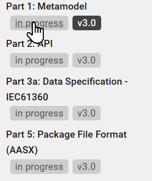

## Industrial Digital Twin Association (IDTA)

Governance of the specifications contained in the repository is done by the [IDTA](https://industrialdigitaltwin.org/en/)

## Asset Administration Shell Specifications
The release of the Asset Administration Shell Specifications can be found here:
https://industrialdigitaltwin.org/en/content-hub/aasspecifications

You find the html documentation under the link:
https://admin-shell-io.github.io/aas-specs-antora/index/home/index.html

The version "in progress" is not yet released but shows the version in work.

The github repositories dedicated to Asset Administration Shell Specifications start with ["**aas-specs**"](https://github.com/orgs/admin-shell-io/repositories?q=aas-specs).
The two repositories ["aas-specs-antora-ui"](https://github.com/admin-shell-io/aas-specs-antora-ui) and ["aas-specs-antora"](https://github.com/admin-shell-io/aas-specs-antora) are used for generating the HTML documentation based on Antora.

## Submodel Template Specifications

The Submodel Template Specifications can be found here: https://industrialdigitaltwin.org/en/content-hub/submodels

The Submodel Templates can be found in https://github.com/admin-shell-io/submodel-templates

## FAQ and Best Practices

Questions often asked and best practices can be found here: https://github.com/admin-shell-io/questions-and-answers

Feel free to add your question as an issue.

## Validation

You built a Submodel Template or a Submodel or you implemented an API conformant to the Asset Administration Shell Specifications?
Then you can validate them, for details see: https://github.com/admin-shell-io/aas-test-engines

